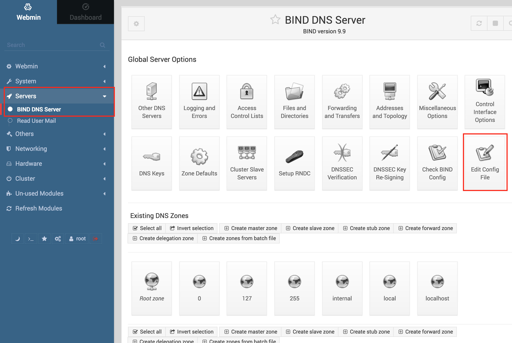

# docker-bind
A bind9 image with simple cli tool

## Add/del record

```sh
docker exec -it bind.local recordadd <zone> <host> <type> <value>
docker exec -it bind.local recorddel <zone> <host> [<type>]
```

Examples:

add git.internal
```sh
docker exec -it bind.local recordadd internal git A 172.22.101.10
```

delete all record about git.internal
```sh
docker exec -it bind.local recorddel internal git
```

## Webadmin

Start container with BIND_WEBMIN_ENABLED=true, access its http port 10000, e.g. `http://bind.local:10000`.

